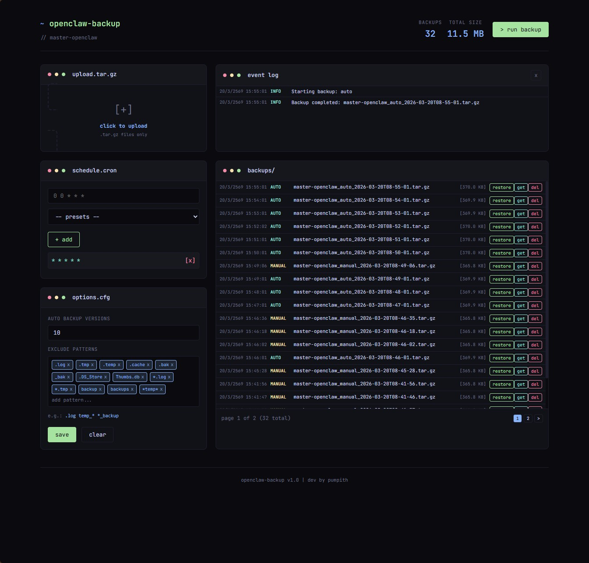

# OpenClaw Backup

Web UI และ CLI สำหรับ backup และ restore OpenClaw data



## Features

- 📦 Create/Restore backups ผ่าน Web UI
- ⬆️ Upload/Download backup files
- ⏰ Schedule automatic backups (cron)
- 📱 Modern dark theme UI
- 🔧 CLI support สำหรับ script

## Installation

```bash
# Clone or copy to ~/.openclaw/workspace/scripts/
git clone https://github.com/pumpithai/openclaw-backup.git
cd openclaw-backup

# Run installer
chmod +x install.sh
./install.sh
```

## Usage

### Web UI

```bash
# Start server (or use ./install.sh to install first)
./start.sh

# Or with custom port
./install.sh 4000
```

Then open: `http://localhost:3847`

### CLI

```bash
# Create full backup
./openclaw-backup.sh

# Backup excluding specific folders
./openclaw-backup.sh --exclude=workspace
./openclaw-backup.sh --exclude=media --exclude=cache

# Backup only specific folder
./openclaw-backup.sh --include-only=skills

# List backups
./openclaw-backup.sh --list

# Restore backup
./openclaw-backup.sh --restore /path/to/backup.tar.gz
```

### Environment Variables

```bash
OPENCLAW_DIR=~/.openclaw     # OpenClaw directory (default: ~/.openclaw)
BACKUP_DIR=~/backups        # Backup location (default: ~/.openclaw/backups)
PORT=3847                   # Web UI port (default: 3847)
```

## Backup Contents

Backups entire `.openclaw` directory with rsync, including:

- `openclaw.json` - Main config
- `credentials/` - API keys & tokens
- `agents/` - Agent configs
- `workspace/` - Workspace files
- `telegram/` - Telegram session data
- `cron/` - Scheduled tasks
- `devices/` - Device configs
- `identity/` - Identity data
- `memory/` - Memory data
- `canvas/` - Canvas data
- `completions/` - Shell completions
- `media/` - Media files
- `skills/` - Custom skills

## Systemd (Auto Start)

```bash
# Create systemd service
mkdir -p ~/.config/systemd/user
cat > ~/.config/systemd/user/openclaw-backup.service << EOF
[Unit]
Description=OpenClaw Backup Server

[Service]
Type=simple
WorkingDirectory=%h/.openclaw/workspace/scripts
ExecStart=/usr/bin/node %h/.openclaw/workspace/scripts/backup-server.js
Restart=on-failure

[Install]
WantedBy=default.target
EOF

# Enable and start
systemctl --user enable --now openclaw-backup
```

## Stop Server

```bash
pkill -f 'node backup-server.js'
```
